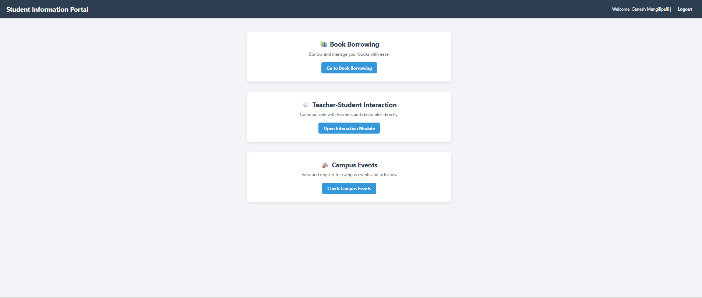
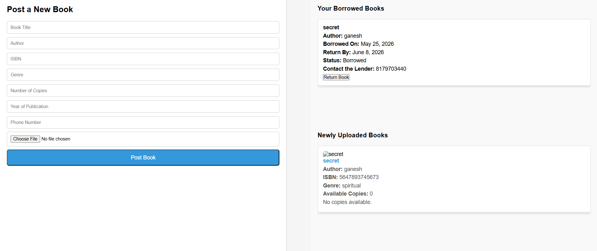
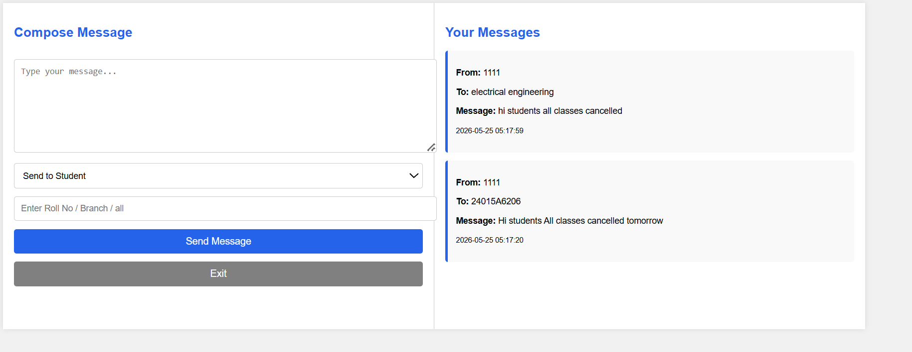
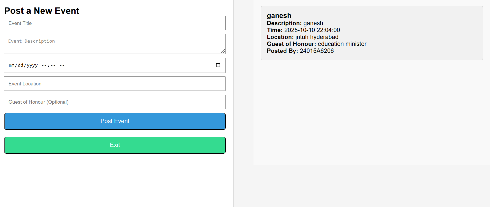

# 🎓 Student Information Portal

A full-stack college management web application built using **PHP, MySQL, HTML, CSS, and JavaScript**.

This portal helps students and teachers interact through multiple integrated modules like:

- 📚 Book Borrowing System
- 💬 Teacher–Student Interaction
- 🎉 Campus Events Management

---

# 🚀 Live Demo

[🔗 Live Website](https://ganeshm005.infinityfreeapp.com)

---

# 📌 Features

## 📚 Book Borrowing Module
- Upload books with images
- Borrow and return books
- Track available copies
- View borrowed books
- Contact lender directly

---

## 💬 Teacher–Student Interaction
- Send messages to:
  - Individual students
  - Teachers
  - Entire branches
  - All users
- Real-time message display
- Session-based authentication

---

## 🎉 Campus Events Module
- Post college events
- View latest events dynamically
- Event details include:
  - Title
  - Description
  - Time
  - Location
  - Guest of Honour

---

## 🔐 Authentication System
- Student signup/login
- Teacher signup/login
- Session handling
- Role-based dashboard

---

# 🛠️ Tech Stack

| Technology | Usage |
|---|---|
| PHP | Backend |
| MySQL | Database |
| HTML5 | Structure |
| CSS3 | Styling |
| JavaScript | Frontend Interactions |
| InfinityFree | Deployment |
| GitHub | Version Control |

---

# 🗂️ Database Tables

```sql
teachers
students
messages
books
borrowed_books
events
```

---

# 📸 Project Screenshots

## 🏠 Main Dashboard



---

## 📚 Book Borrowing Module



### Features:
- Upload books
- Borrow books
- Track copies
- Return books

---

## 💬 Teacher–Student Interaction



### Features:
- Send messages
- Branch-wide announcements
- Real-time communication

---

## 🎉 Campus Events Module



### Features:
- Post events
- Display event details
- Dynamic event listing

Features:
- Post events
- Display event details
- Dynamic event listing

---

# ⚙️ Installation Guide

## 1️⃣ Clone Repository

```bash
git clone https://github.com/YOUR_USERNAME/YOUR_REPOSITORY.git
```

---

## 2️⃣ Move Project to htdocs

If using XAMPP:

```text
xampp/htdocs/
```

---

## 3️⃣ Create Database

Open:
```text
phpMyAdmin
```

Create database:

```sql
CREATE DATABASE student_portal;
```

---

## 4️⃣ Import SQL Tables

Run all SQL queries from:
```text
database.sql
```

---

## 5️⃣ Configure Database Connection

Edit:

```text
db.php
```

Update:

```php
$host = "localhost";
$user = "root";
$password = "";
$database = "student_portal";
```

---

## 6️⃣ Run Project

Open:

```text
http://localhost/project-folder-name
```

---

# 🌐 Deployment

Deployed using:
- InfinityFree Hosting
- phpMyAdmin
- Online File Manager

---

# 📁 Project Structure

```text
├── index.php
├── login.php
├── signup.php
├── borrow.php
├── message.php
├── campus_events.php
├── fetch_events.php
├── db.php
├── uploads/
├── screenshots/
└── README.md
```

---

# 🔥 Key Highlights

✅ Full-stack PHP project  
✅ Real database integration  
✅ Dynamic event system  
✅ Messaging system  
✅ Authentication & Sessions  
✅ File upload support  
✅ Live deployment  
✅ Responsive UI  

---

# 📈 Future Improvements

- Email notifications
- Admin dashboard
- Search & filters
- Password hashing
- JWT authentication
- Mobile responsive optimization
- Real-time chat using WebSockets

---

# 👨‍💻 Developer

## Ganesh Mangilipelli

- MERN Stack Learner
- Full Stack Developer
- GenAI & System Design Enthusiast

### GitHub
[🔗 GitHub Profile](https://github.com/YOUR_USERNAME)

---

# ⭐ Support

If you like this project:

⭐ Star the repository  
🍴 Fork the project  
📢 Share feedback  

---

# 📜 License

This project is developed for educational and portfolio purposes.
